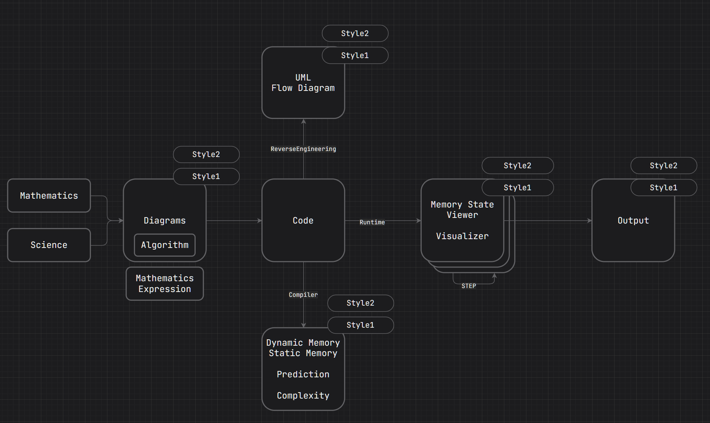
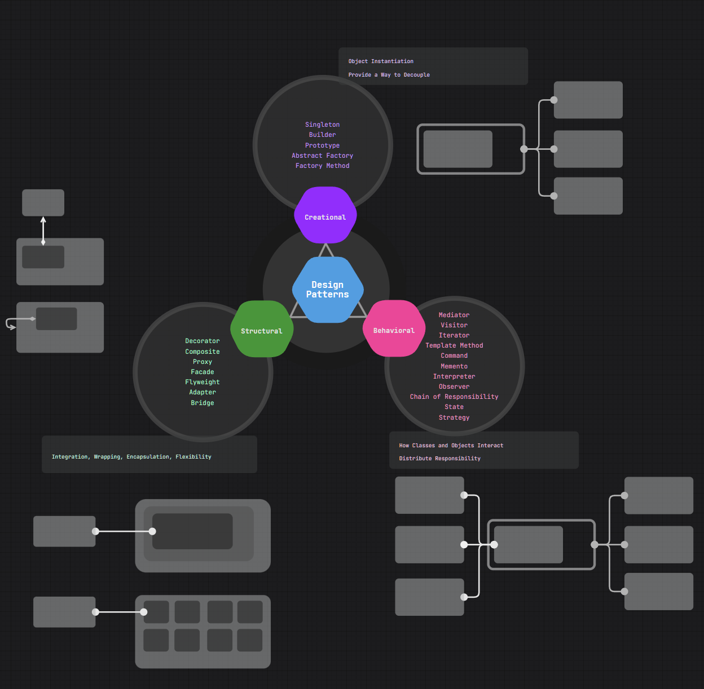

# **コンピューター科学と研究について**
Youtube Channel
https://www.youtube.com/watch?v=fTSos2ySZEI

こちらはコンピューター科学が未来の重要な分野になっており、
分かりやすく効率的に学習できるために開設されました。
以下のような項目で最新情報や学習資料を提供していきたいと思います。

### コンピューター科学(Computer Science)
1. Calculator, Hardware
2. Programming Language
3. Algorithm
4. Data Structure
5. Software Engineering 
6. Database
7. BigData, Cloud
8. ML, AI
9. Network Programming
10. System Programmming

### 設計、構築、Frameworkの開発

共通
1. OOP Design Patterns 
2. SQL Design Patterns

### 基礎につながる科目
1. Mathematics > AI, 3D
2. Science > Physics
3. Chemistry > Electronics

### Visualizer
Interviews, Problem, Solution, DataStructureなどを
Javascriptで開発しようとおもいます。

一連の流れを理解して応用できるようにします。

#### 2024以降のトレンド言語に関して
1. Python
2. Java/C#
3. JavaScript/TypeScript
4. C/C++

##### 1. OOP Design Patterns

